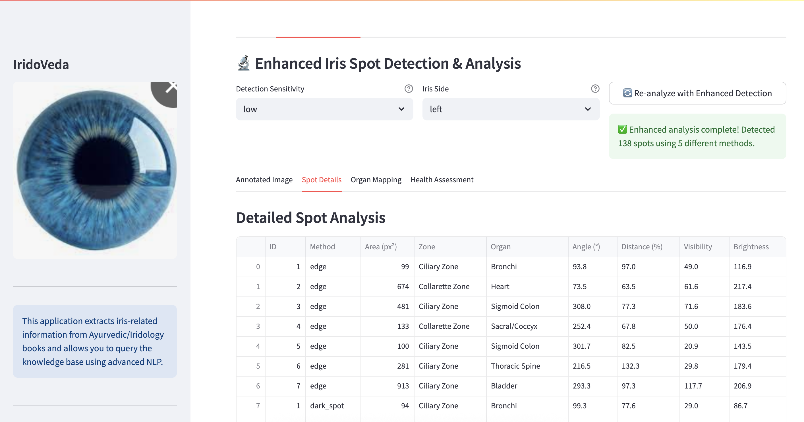

# IridoVeda: Ayurvedic Iridology Knowledge Base

<p align="center">
  
</p>

## Overview

IridoVeda is a Streamlit application that extracts iris-related information from Ayurvedic and Iridology books, stores it as vector embeddings in Qdrant, and provides a query interface to access this knowledge. The application can also analyze iris images to generate relevant health queries and performs advanced iris analysis using computer vision and machine learning techniques.

Powered by [Dinexora](https://www.dinexora.de)

## Features

- PDF upload and extraction of iris-related information
- Focus on "how", "why", and "when" questions about iridology
- Vector database storage using Qdrant
- Natural language querying of the knowledge base
- Comprehensive iris image analysis with zone mapping
- Advanced iris analysis with color, texture, and spot detection
- Pattern matching with similar iris patterns
- Ayurvedic dosha quantification (Vata, Pitta, Kapha)
- Metabolic health metrics estimation
- Organ health assessment based on iris features
- Personalized health recommendations based on dosha profile
- Health insights and Ayurvedic recommendations
- PDF and HTML report generation

## 🔬 Iris Image Analysis Features

IridoVeda provides state-of-the-art iris image analysis capabilities that combine traditional Ayurvedic iridology with modern computer vision and machine learning techniques.

### 🎯 Core Analysis Modules

#### 1. **Advanced Image Segmentation**
- **Automatic Iris Detection**: Precisely identifies and extracts the iris region from uploaded images
- **Boundary Detection**: Advanced algorithms to define iris boundaries and exclude pupil/sclera areas
- **Quality Assessment**: Validates image quality and provides feedback for optimal analysis
- **Multi-format Support**: Supports JPEG, PNG, and other common image formats

#### 2. **Color Pattern Analysis**
- **Dominant Color Extraction**: Identifies primary and secondary colors in different iris zones
- **Color Distribution Mapping**: Quantifies color percentages across iris regions
- **Ayurvedic Color Interpretation**: Links colors to dosha characteristics (Vata, Pitta, Kapha)
- **Constitutional Assessment**: Determines individual constitution based on color patterns

#### 3. **Texture and Fiber Analysis**
- **Iris Fiber Patterns**: Analyzes radial fiber structures and density variations
- **Texture Metrics**: Calculates contrast, uniformity, energy, and entropy measurements
- **Structural Assessment**: Evaluates lacunae, crypts, and other structural features
- **Tissue Integrity Analysis**: Assesses iris tissue quality and constitutional strength

#### 4. **Spot and Marking Detection**
- **Automatic Spot Detection**: Uses computer vision to identify spots, freckles, and pigmentation
- **Zone-based Mapping**: Maps detected features to specific organ systems
- **Toxicity Assessment**: Analyzes spots for potential detoxification needs
- **Pigment Classification**: Categorizes different types of pigmentation and their meanings

#### 5. **Intelligent Zone Mapping**
- **12-Zone Analysis**: Comprehensive mapping based on traditional iridology zones
- **Organ System Correlation**: Links iris zones to corresponding body systems
- **Health Status Indicators**: Provides insights into organ function and vitality
- **Comparative Analysis**: Tracks changes over time with multiple image uploads

### 🧬 Advanced Analysis Capabilities

#### **Pattern Recognition & Matching**
- **Vector Database Storage**: Stores iris patterns as high-dimensional vectors in Qdrant
- **Similarity Search**: Finds similar iris patterns from historical data
- **Feature Comparison**: Detailed comparison of features between different iris images
- **Population Analysis**: Comparative analysis against stored pattern database

#### **Dosha Quantification Engine**
- **Multi-parameter Analysis**: Combines color, texture, and structural features
- **Weighted Scoring System**: Advanced algorithms for accurate dosha percentage calculation
- **Constitutional Typing**: Determines Prakriti (original constitution) and Vikriti (current state)
- **Imbalance Detection**: Identifies specific dosha imbalances and their severity

#### **Health Metrics Calculation**
- **Metabolic Indicators**: Estimates BMR, metabolic efficiency, and energy levels
- **Cardiovascular Markers**: Analyzes circulation patterns and heart health indicators
- **Digestive Assessment**: Evaluates digestive fire (Agni) and gut health
- **Nervous System Analysis**: Assesses stress levels and nervous system function

### 📊 Visualization and Reporting

#### **Interactive Analysis Dashboard**
- **Real-time Processing**: Live analysis updates as images are uploaded
- **Multi-tab Interface**: Organized views for different analysis aspects
- **Visual Overlays**: Graphical representations of zones, spots, and patterns
- **Progress Indicators**: Clear feedback during analysis processing

#### **Comprehensive Reports**
- **PDF Generation**: Professional reports with detailed analysis and recommendations
- **Visual Documentation**: Before/after comparisons and annotated iris images
- **Ayurvedic Insights**: Traditional interpretations combined with modern analysis
- **Actionable Recommendations**: Personalized health suggestions and lifestyle advice

#### **Data Export Options**
- **Analysis Results**: Export detailed numerical data and measurements
- **Image Annotations**: Save annotated images with analysis overlays
- **Historical Tracking**: Compare multiple analyses over time
- **Integration Ready**: JSON/CSV exports for integration with other health systems

### 🎯 Practical Applications

#### **Healthcare Practitioners**
- **Client Assessment**: Comprehensive constitutional analysis for new clients
- **Treatment Monitoring**: Track progress and treatment effectiveness over time
- **Documentation**: Professional reports for client records and consultation notes
- **Education**: Visual tools for explaining constitutional patterns to clients

#### **Personal Health Management**
- **Self-Assessment**: Understanding your own constitutional makeup
- **Lifestyle Optimization**: Personalized recommendations for diet, exercise, and daily routines
- **Health Monitoring**: Regular check-ins to track constitutional changes
- **Preventive Care**: Early detection of potential imbalances before symptoms appear

#### **Research and Education**
- **Pattern Studies**: Large-scale analysis of iris patterns and health correlations
- **Educational Material**: Visual examples for teaching iridology principles
- **Data Collection**: Building comprehensive databases of iris patterns and health outcomes
- **Validation Studies**: Supporting research into traditional iridology claims

### 🚀 Technology Stack

- **Computer Vision**: OpenCV and advanced image processing algorithms
- **Machine Learning**: TensorFlow/PyTorch for pattern recognition and classification
- **Vector Database**: Qdrant for efficient similarity search and pattern storage
- **Natural Language Processing**: spaCy for text analysis and knowledge extraction
- **Ayurvedic Knowledge Base**: Comprehensive database of traditional iridology principles
- **Modern UI/UX**: Streamlit-based interface for intuitive user experience

## Getting Started

### Option 1: Using Docker Compose (Recommended)

1. Make sure Docker and Docker Compose are installed on your system
2. Clone this repository
3. Navigate to the project directory
4. Run the Docker setup script (handles common build issues):

```bash
./setup_docker.sh
```

Or manually run the application:

```bash
docker-compose up
```

5. Access the application at: http://localhost:8501

### Option 2: Local Setup

1. Install Python 3.10 or higher
2. Install Tesseract OCR (for PDF OCR capabilities)
3. Run Qdrant vector database with Docker:

```bash
docker run -d -p 6333:6333 -p 6334:6334 --name qdrant qdrant/qdrant
```

4. Create a virtual environment and install dependencies:

```bash
python -m venv venv
source venv/bin/activate  # On Windows: venv\Scripts\activate
pip install -r requirements.txt
```

5. Run the application:

```bash
./run.sh
```

## Usage

### 📚 Knowledge Base Management
1. Upload Ayurvedic/Iridology books in PDF format
2. Process the PDFs to extract iris-related information (choose between standard and enhanced processing)
3. Store the extracted information in the knowledge base
4. Query the knowledge base with natural language questions
5. Explore statistics and insights about your knowledge base

### 👁️ Iris Image Analysis Workflow
1. **Image Upload**: Navigate to the "🧬 Advanced Analysis" or "Dosha Analysis" tab
2. **Image Selection**: Upload a clear, high-resolution iris image (JPEG/PNG format)
3. **Automatic Processing**: The system will automatically:
   - Detect and segment the iris region
   - Analyze color patterns and distribution
   - Identify spots, markings, and structural features
   - Calculate texture metrics and fiber patterns
   - Map features to traditional iridology zones
4. **Results Exploration**: Browse through different analysis tabs:
   - **Color Analysis**: View dominant colors and their Ayurvedic interpretations
   - **Spot Detection**: See identified spots mapped to organ systems
   - **Texture Analysis**: Examine fiber patterns and structural integrity
   - **Pattern Matching**: Compare with similar iris patterns in the database
   - **Dosha Analysis**: View your constitutional makeup and current imbalances
5. **Report Generation**: Generate comprehensive PDF reports with:
   - Detailed analysis results and visualizations
   - Personalized Ayurvedic recommendations
   - Lifestyle and dietary suggestions
   - Health insights and organ assessments

### 🎯 Best Practices for Iris Photography
- **Lighting**: Use natural daylight or consistent white LED lighting
- **Distance**: Maintain 6-12 inches from the eye
- **Focus**: Ensure the iris is in sharp focus
- **Angle**: Capture straight-on view without tilting
- **Quality**: Use high-resolution images (minimum 800x600 pixels)
- **Format**: Upload in JPEG or PNG format for best compatibility

## Project Structure

```
iridoveda/
├── app.py                          # Basic Streamlit UI
├── advanced_app.py                 # Advanced Streamlit UI with enhanced features
├── pdf_extractor.py                # Extract & filter iris text
├── enhanced_pdf_extractor.py       # Advanced text extraction with NLP
├── iris_qdrant.py                  # Basic Qdrant vector DB integration
├── enhanced_iris_qdrant.py         # Advanced vector search capabilities
├── iris_predictor.py               # ML model for iris image analysis
├── iris_zone_analyzer.py           # Advanced zone-based iris analysis
├── iris_report_generator.py        # PDF report generation
├── context_aware_answers.py        # Generate answers from search results
├── ocr_pdf.py                      # OCR processing for scanned PDFs
├── advanced_iris_analyzer.py       # Integration of advanced iris analysis components
├── iris_advanced_segmentation.py   # Enhanced iris boundary detection algorithms
├── iris_feature_extractor.py       # Color, texture, and spot feature extraction
├── iris_pattern_matcher.py         # Pattern storage and similarity search using Qdrant
├── dosha_quantification_model.py   # Ayurvedic dosha analysis and health metrics
├── docker-compose.yml              # Multi-container Docker setup
├── Dockerfile                      # Container configuration
├── run.sh                          # Basic mode startup script
├── run_enhanced.sh                 # Enhanced mode startup script
├── run_dosha_app.sh                # Start app with dosha analysis features
├── setup.sh                        # Basic setup script
├── setup_advanced.sh               # Advanced setup script with all features
├── static/                         # Static assets (logos, etc.)
├── uploads/                        # Directory for uploaded PDFs
├── fonts/                          # Fonts for PDF report generation
├── requirements.txt                # Python dependencies
└── docker-compose.yml              # Docker Compose configuration
```

## Advanced Features

- **Enhanced NLP Processing**: More accurate text extraction with semantic understanding
- **Multi-Query Search**: Improved search accuracy through query expansion
- **Iris Zone Analysis**: Detailed mapping of iris zones to body systems
- **PDF Report Generation**: Comprehensive reports with Ayurvedic insights
- **Context-Aware Answers**: AI-generated responses synthesized from multiple sources
- **Statistical Insights**: Analyze the content of your knowledge base

## Ayurvedic Dosha Analysis

IridoVeda now includes a comprehensive Ayurvedic dosha analysis module that quantifies Vata, Pitta, and Kapha doshas from iris images and provides detailed health metrics and organ assessments.

### Key Features

- **Dosha Quantification**: Analysis of iris features to determine Vata, Pitta, and Kapha percentages
- **Health Metrics**: Calculation of metabolic indicators including basal metabolic rate, serum lipid, triglycerides, and more
- **Organ Health Assessment**: Evaluation of major organs based on iris zones and dosha influences
- **Personalized Recommendations**: Ayurvedic health recommendations based on your unique dosha profile

### Getting Started with Dosha Analysis

1. Launch the application with dosha analysis support:
   ```bash
   ./run_dosha_app.sh
   ```

2. Navigate to the "Dosha Analysis" tab in the application
3. Upload a clear iris image
4. View your comprehensive dosha profile and health assessment

For more detailed information about the dosha analysis feature, see [DOSHA_ANALYSIS.md](DOSHA_ANALYSIS.md).

## Contact & Support

For questions, support, or custom implementations:
- 📧 Email: [contact@dinexora.de](mailto:contact@dinexora.de)
- 🌐 Website: [www.dinexora.de](https://www.dinexora.de)

## License

This project is licensed under the MIT License - see the LICENSE file for details.

## Troubleshooting

### Installation Issues

#### Spacy Installation Errors

If you see errors like:
```
Failed to build spacy
ERROR: Could not build wheels for spacy, which is required to install pyproject.toml-based projects
```

Try these solutions:

1. **Update pip first:**
   ```bash
   pip install --upgrade pip
   ```

2. **Install build dependencies separately:**
   ```bash
   pip install wheel setuptools cython
   pip install spacy --no-build-isolation
   ```

3. **Use the Conda installation method:**
   Use the `./setup_conda.sh` script which handles these dependencies better.

#### Docker Build Issues

If you encounter errors when building the Docker image like:

```
ValueError: numpy.dtype size changed, may indicate binary incompatibility. Expected 96 from C header, got 88 from PyObject
```

This is typically caused by a version mismatch between numpy and packages that depend on it. Try these solutions:

1. **Use the pre-built image** (recommended):
   ```bash
   docker pull dinexora/iridoveda:latest
   docker run -p 8501:8501 dinexora/iridoveda:latest
   ```

2. **Build with the fixed Dockerfile**:
   The repository includes an updated Dockerfile that fixes these compatibility issues by:
   - Installing numpy with a fixed version first
   - Installing spacy with the `--no-build-isolation` flag
   - Directly downloading the spacy language model from GitHub

3. **Clean Docker cache and rebuild**:
   ```bash
   docker system prune -a
   docker-compose build --no-cache
   docker-compose up
   ```

#### Missing Language Model Errors

If you encounter errors related to missing spacy language models:

```bash
python -m spacy download en_core_web_sm
```

### Runtime Issues

#### Qdrant Connection Problems

If the application can't connect to Qdrant:

1. Check if the Qdrant container is running:
   ```bash
   docker ps | grep qdrant
   ```

2. Start Qdrant if it's not running:
   ```bash
   docker run -d -p 6333:6333 -p 6334:6334 qdrant/qdrant
   ```

3. Ensure the environment variables are set correctly:
   ```bash
   export QDRANT_HOST=localhost
   export QDRANT_PORT=6333
   ```

#### Image Processing Errors

If you encounter errors when processing iris images:

1. Check if OpenCV is installed correctly
2. Verify that the image is a valid iris image
3. Try processing a different image to see if the issue is with a specific file

# IridoVeda - Powered by Dinexora
