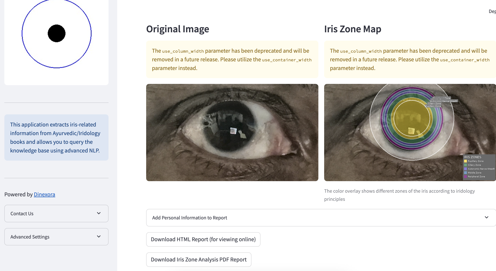

# IridoVeda: Ayurvedic Iridology Knowledge Base

<p align="center">
  
</p>

## Overview

IridoVeda is a Streamlit application that extracts iris-related information from Ayurvedic and Iridology books, stores it as vector embeddings in Qdrant, and provides a query interface to access this knowledge. The application can also analyze iris images to generate relevant health queries.

Powered by [Dinexora](https://www.dinexora.de)

## Features

- PDF upload and extraction of iris-related information
- Focus on "how", "why", and "when" questions about iridology
- Vector database storage using Qdrant
- Natural language querying of the knowledge base
- (Optional) Iris image analysis and health prediction

## Getting Started

### Option 1: Using Docker Compose (Recommended)

1. Make sure Docker and Docker Compose are installed on your system
2. Clone this repository
3. Navigate to the project directory
4. Run the application:

```bash
docker-compose up
```

5. Access the application at: http://localhost:8501

### Option 2: Local Setup

1. Install Python 3.10 or higher
2. Install Tesseract OCR (for PDF OCR capabilities)
3. Run Qdrant vector database with Docker:

```bash
docker run -d -p 6333:6333 -p 6334:6334 --name qdrant qdrant/qdrant
```

4. Create a virtual environment and install dependencies:

```bash
python -m venv venv
source venv/bin/activate  # On Windows: venv\Scripts\activate
pip install -r requirements.txt
```

5. Run the application:

```bash
./run.sh
```

## Project Structure

```
iridoveda/
├── app.py                      # Basic Streamlit UI
├── advanced_app.py             # Advanced Streamlit UI with enhanced features
├── pdf_extractor.py            # Extract & filter iris text
├── enhanced_pdf_extractor.py   # Advanced text extraction with NLP
├── iris_qdrant.py              # Basic Qdrant vector DB integration
├── enhanced_iris_qdrant.py     # Advanced vector search capabilities
├── iris_predictor.py           # ML model for iris image analysis
├── iris_zone_analyzer.py       # Advanced zone-based iris analysis
├── iris_report_generator.py    # PDF report generation
├── context_aware_answers.py    # Generate answers from search results
├── ocr_pdf.py                  # OCR processing for scanned PDFs
├── docker-compose.yml          # Multi-container Docker setup
├── Dockerfile                  # Container configuration
├── run.sh                      # Basic mode startup script
├── run_enhanced.sh             # Enhanced mode startup script
├── static/                     # Static assets (logos, etc.)
├── uploads/                    # Directory for uploaded PDFs
├── fonts/                      # Fonts for PDF report generation
├── requirements.txt            # Python dependencies
└── docker-compose.yml          # Docker Compose configuration
```

## Setup and Installation

### Local Development

1. Set up a Python virtual environment:

```bash
python3 -m venv venv
source venv/bin/activate  # On Windows: venv\Scripts\activate
```

2. Install dependencies:

```bash
pip install -r requirements.txt
```

3. Run Qdrant (either locally with Docker or connect to a cloud instance):

```bash
docker run -p 6333:6333 -p 6334:6334 qdrant/qdrant
```

4. Run the Streamlit app:

```bash
# For basic version:
streamlit run app.py

# For enhanced version (recommended):
streamlit run advanced_app.py
```

### Using Docker Compose

1. Build and start the containers:

```bash
# Build the containers
docker compose build

# Start in detached mode
docker compose up -d

# View logs if needed
docker compose logs -f
```

2. Access the application at `http://localhost:8501`

3. Stop the containers when done:

```bash
docker compose down
```

## Usage

1. Upload Ayurvedic/Iridology books in PDF format
2. Process the PDFs to extract iris-related information (choose between standard and enhanced processing)
3. Store the extracted information in the knowledge base
4. Query the knowledge base with natural language questions
5. Upload iris images for analysis and recommendations
6. Generate detailed iris zone analysis reports
7. Explore statistics and insights about your knowledge base

## Advanced Features

- **Enhanced NLP Processing**: More accurate text extraction with semantic understanding
- **Multi-Query Search**: Improved search accuracy through query expansion
- **Iris Zone Analysis**: Detailed mapping of iris zones to body systems
- **PDF Report Generation**: Comprehensive reports with Ayurvedic insights
- **Context-Aware Answers**: AI-generated responses synthesized from multiple sources
- **Statistical Insights**: Analyze the content of your knowledge base

## Contact & Support

For questions, support, or custom implementations:
- 📧 Email: [contact@dinexora.de](mailto:contact@dinexora.de)
- 🌐 Website: [www.dinexora.de](https://www.dinexora.de)

## License

This project is licensed under the MIT License - see the LICENSE file for details.

# IridoVeda - Powered by Dinexora
